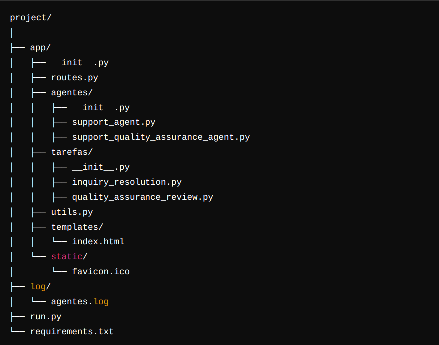

### CrewAI Support Interface
## Descrição
- A CrewAI Support Interface é uma aplicação web desenvolvida com Flask para gerenciar agentes e tarefas usando a biblioteca CrewAI. Esta aplicação permite que os usuários enviem consultas e recebam respostas detalhadas e precisas de agentes configurados para fornecer suporte ao cliente.

## Estrutura do Projeto
  

## Dependências
- As dependências do projeto estão listadas no arquivo requirements.txt. Para instalar todas as dependências necessárias, execute:

pip install -r requirements.txt

## Configuração
# Chave da API OpenAI
- Configure a chave da API OpenAI no ambiente:

export OPENAI_API_KEY='sua_chave_api_aqui'

## Estrutura de Arquivos
1. Arquivos Principais
'run.py'
- Arquivo principal para iniciar a aplicação Flask.

'app/__init__.py'

- Configura a aplicação Flask, registrando blueprints e configurando CORS.

2. Agentes
- Os agentes são configurados para fornecer suporte e garantia de qualidade.

'app/agentes/support_agent.py'
- Agente que representa o suporte sênior.

'app/agentes/support_quality_assurance_agent.py'
- Agente que representa o especialista em garantia de qualidade.

3. Tarefas
- As tarefas são atribuídas aos agentes para resolver consultas e revisar respostas.

'app/tarefas/inquiry_resolution.py'
- Tarefa para resolução de consultas.

'app/tarefas/quality_assurance_review.py'
- Tarefa para revisão de garantia de qualidade

4. API
- A API é responsável por receber as consultas dos usuários e retornar as respostas geradas pelos agentes.

'app/routes.py'

## Executar a Aplicação
- Instale as dependências:
pip install -r requirements.txt

- Configure a chave da API OpenAI no ambiente:
export OPENAI_API_KEY='sua_chave_api_aqui'

- Inicie a aplicação:
python3 run.py

## Acesse a interface:
- Abra o navegador e vá para http://127.0.0.1:5000 para interagir com a aplicação.

Desenvolvido por João Maykon Mendes Ferreira
https://www.linkedin.com/in/joaomaykonmf/